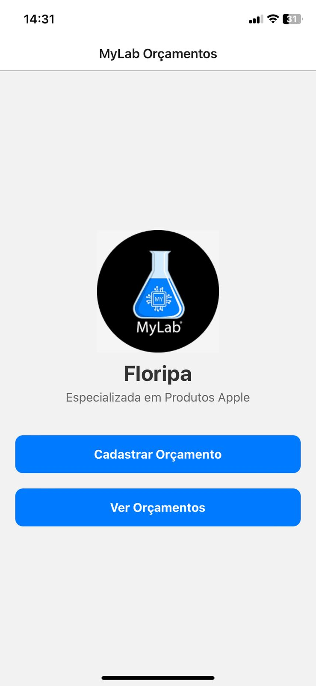
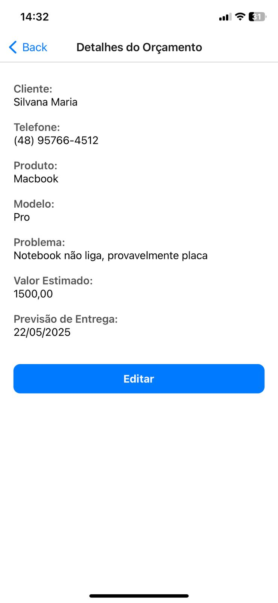
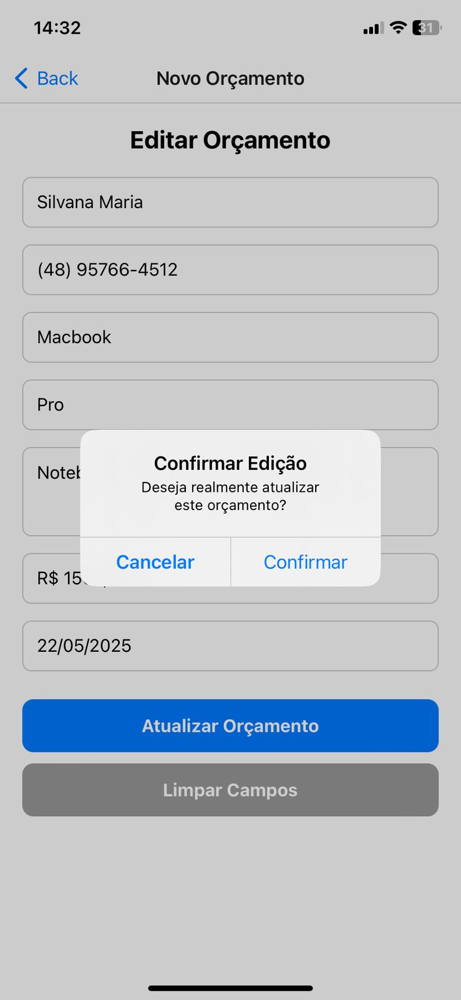

# MyLab Floripa - Orçamentos

Aplicativo mobile desenvolvido com React Native e Expo para auxiliar na criação e gestão de orçamentos em uma assistência técnica especializada em produtos Apple.

## Funcionalidades

- Cadastro de orçamentos com nome, produto, modelo, valor e data de entrega
- Lista com valor total dos orçamentos
- Edição e exclusão de orçamentos
- Armazenamento local com AsyncStorage
- Layout adaptado para Android e iOS

## Tecnologias

- React Native
- Expo
- AsyncStorage
- React Navigation

## Instalação

```bash
git clone https://github.com/AlmeidaLadson/mylab-orcamentos
cd mylab-orcamentos
npm install
npx expo start
```

Use o app Expo Go para rodar o projeto em um dispositivo Android ou iOS.

## Estrutura

```
src/
├── screens/
│   ├── HomeScreen.js
│   ├── CadastroOrcamentoScreen.js
    ├── ListaOrcamentosScreen.js
│   └── DetalhesOrcamentoScreen.js
├── services/
│   └── AsyncStorageService.js
├── assets/
└── App.js
```

## Objetivo

Este aplicativo foi desenvolvido como parte de um projeto de extensão acadêmica do curso de Análise e Desenvolvimento de Sistemas, com o objetivo de aplicar na prática os conhecimentos em desenvolvimento mobile utilizando React Native. A proposta consiste em criar uma solução simples e funcional para auxiliar uma assistência técnica especializada em produtos Apple na organização e controle de orçamentos, simulando um cenário real de uso.

## Capturas de Tela

### Tela Inicial


### Tela de Novo Orçamento


### Erro Preencha Todos os Campos


### Erro Preencha Todos os Campos


### Lista de Orçamentos


### Informações do Orçamento


### Editar Orçamento


### Confirmar Edição


### Excluir Orçamento
